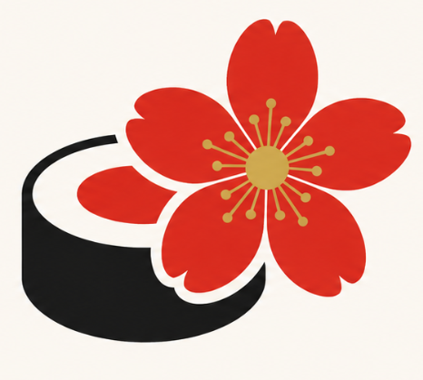
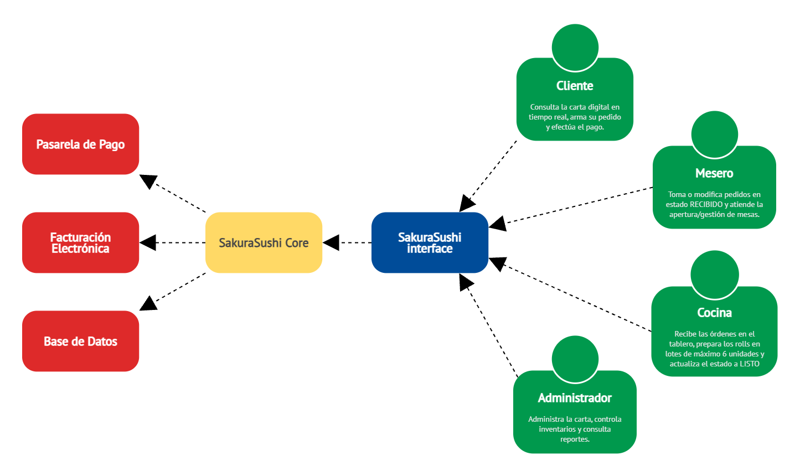

#  **SakuraSushi**

## **1. Descripción**
SakuraSushi es un restaurante de comida japonesa que se encuentra en proceso de modernización a través de una plataforma web. Actualmente la meta es realizar una transición de los métodos tradicionales en papel hacia un entorno 100% digital que conecte la cocina, la barra de sushi, los pedidos, el pago y la administración.

> Lo que se espera de la plataforma web es que los clientes puedan ver la carta, armar su pedido y seguir su preparación; que los meseros puedan tomar y gestionar las órdenes; y que la cocina y la administración puedan operar sin papeles.

Lo que hace distinto a SakuraSushi de los demás restaurantes es su barra de sushi con preparación por lotes y rolls armados a pedido.

## **2. Brand kit de SakuraSushi**

### Paleta de Colores

| Color          | Hex       | Uso                                           |
| -------------- | --------- | --------------------------------------------- |
| Rojo Torii     | `#D32F2F` | Botones primarios, acentos, estado "activo"   |
| Negro Azabache | `#1A1A1A` | Textos principales, encabezados               |
| Blanco Nieve   | `#FFFFFF` | Fondos de tarjetas, textos sobre fondo oscuro |
| Dorado Premium | `#C9A84C` | Detalles de rolls especiales, precios         |
| Crema Arroz    | `#F9F6F0` | Fondo general de la aplicación                |
| Verde Wasabi   | `#7CB342` | Confirmaciones, estados "disponible"          |

### Tipografía
- **Títulos y encabezados:** `Montserrat` (Bold 700) – moderna y legible.
- **Cuerpo de texto y precios:** `Inter` (Regular 400) – alta legibilidad en pantallas.
- *Alternativa japonesa (opcional):* `Noto Sans JP` para dar un toque cultural en el título principal.

## **3. Diagrama Contexto**

